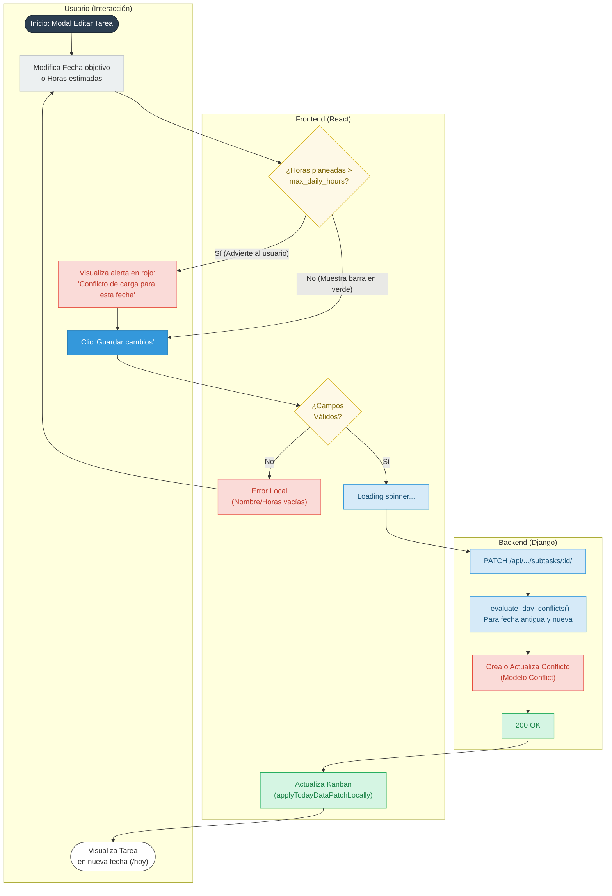

# Diagrama de decisiones para Reprogramación (US-6)

Este flujo documenta la Heurística de Prevención de Errores: cómo el frontend evalúa y advierte al
usuario si su reprogramación generará un conflicto de carga _antes_ de enviar la petición al
backend.

