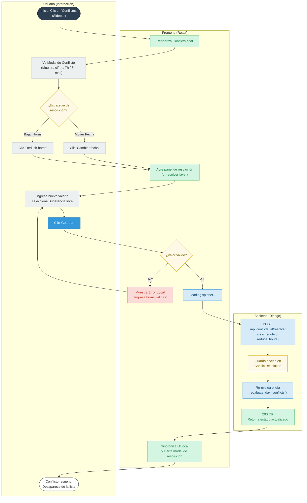

# Diagrama de decisiones para Resolución de Conflictos (US-6)

Este diagrama ilustra el flujo crítico del sprint (Gating), detallando cómo el usuario percibe la
relación matemática de la sobrecarga y los pasos para recuperar un plan viable.

